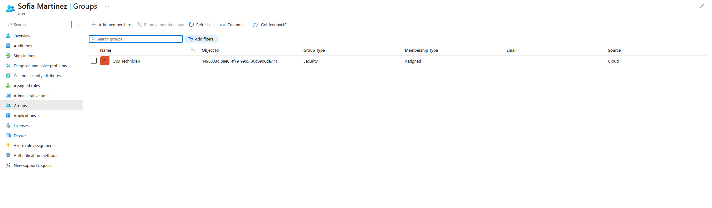
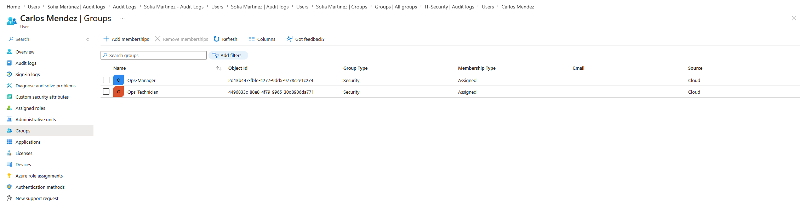
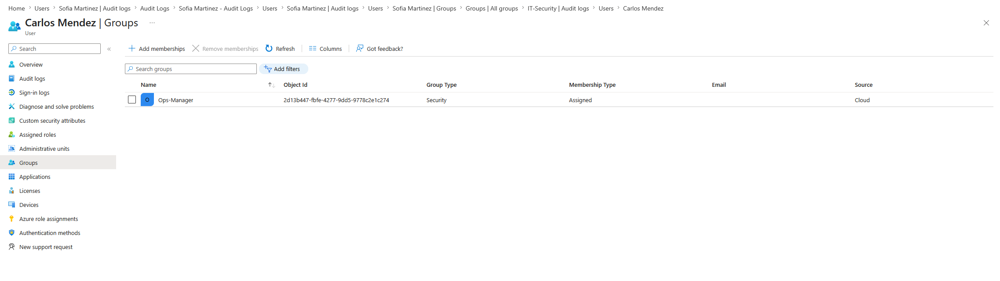
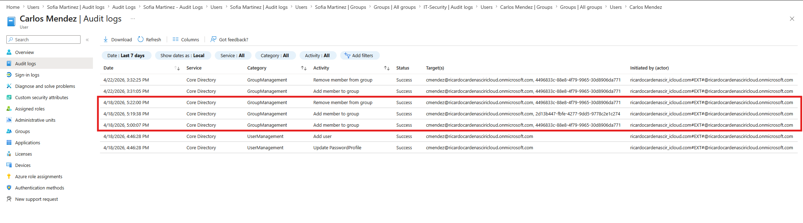
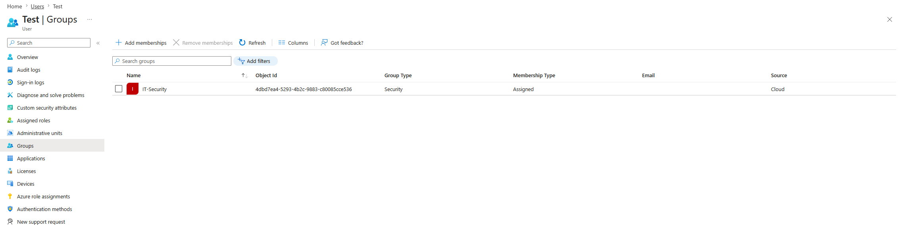
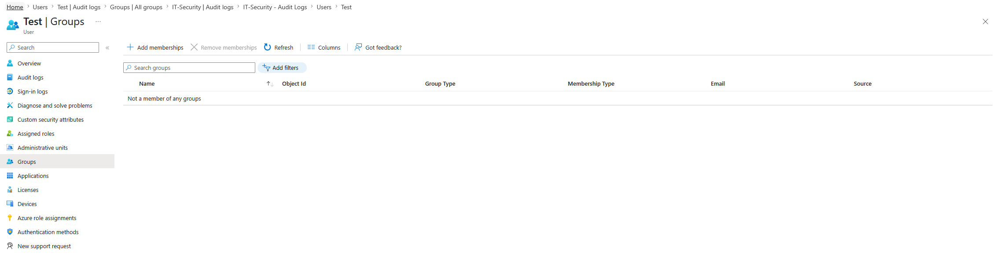
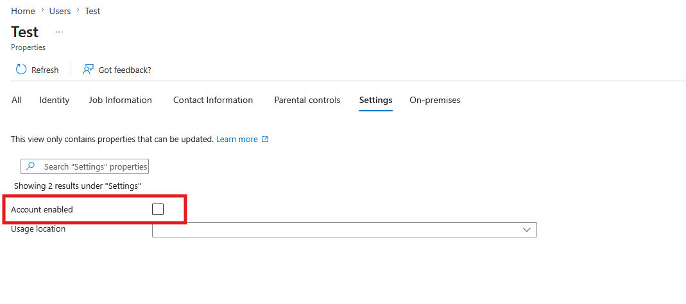
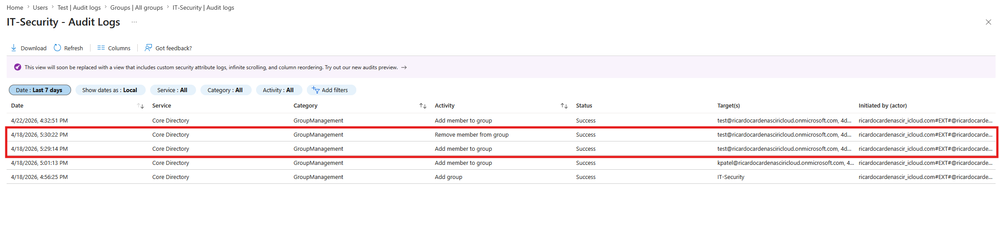

# 🔐 Identity Lifecycle & Security Monitoring Lab  
**IronGate Logistics (Simulated Environment)**

---
> Built to simulate real-world IAM operations and security monitoring in a cloud identity environment.
---

## 📌 Overview
This project simulates a real-world **Identity and Access Management (IAM)** environment using Microsoft Entra ID. The lab demonstrates how organizations manage user access throughout the **Joiner–Mover–Leaver (JML)** lifecycle while also identifying and responding to security risks such as **privilege creep** and **unauthorized privilege escalation**.

IronGate Logistics is a fictional mid-sized logistics company used to simulate real-world identity and access management scenarios.

> ⚠️ Disclaimer: This is a simulated lab environment created for educational and portfolio purposes. No real company data or systems were used.

---

## 🔄 Identity Lifecycle Flow

Joiner → Assign Access → Monitor Logs  
Mover → Detect Privilege Creep → Remediate  
Leaver → Disable Account → Remove Access  
Incident → Detect → Investigate → Contain

---

## 🏢 Environment
- Platform: Microsoft Entra ID  
- Tenant: IronGate Logistics (lab)  
- Model: Role-Based Access Control (RBAC)

---

## 🧱 Architecture

### Departments & Roles
- Operations (Technicians, Managers)
- Administration
- Finance
- IT / Security

### Security Groups
- Ops-Technician  
- Ops-Manager  
- Admin-Staff  
- Finance-Accounting  
- IT-HelpDesk  
- IT-Security  

---

## 👥 Baseline Users

| User | Role | Assigned Group |
|------|------|---------------|
| Carlos Mendez | Technician | Ops-Technician |
| Maria Lopez | Admin Staff | Admin-Staff |
| David Chen | Finance | Finance-Accounting |
| Alex Rivera | IT Support | IT-HelpDesk |
| Kevin Patel | Security | IT-Security |
| Test User | Test Account | None initially |

---

# 🟢 Joiner Scenario (Onboarding)

### Objective:
Simulate onboarding a new employee using least privilege.

### Actions:
- Created user: **Sofia Martinez**
- Assigned group: **Ops-Technician**

### Validation:
- Verified group membership
- Confirmed actions in audit logs:
  - Add user
  - Add member to group

### Security Insight:
Proper onboarding ensures users receive only the access required for their role, reducing the attack surface.

## Screenshot

**Why it matters:** Improper onboarding can introduce excessive access from day one, increasing organizational risk.

---

# 🔵 Mover Scenario (Privilege Creep)

### Objective:
Simulate a role change and identify improper access handling.

### Actions (Incorrect):
- Promoted Carlos Mendez to Ops-Manager
- Failed to remove Ops-Technician access

### Issue Identified:
- User had multiple roles → **Privilege Creep**

### Remediation:
- Removed Ops-Technician access
- Retained only Ops-Manager role

### Validation:
- Verified corrected access
- Observed audit logs:
  - Add member to group
  - Remove member from group

### Security Insight:
Privilege creep increases risk by granting unnecessary access, which can be exploited by attackers.

## Screenshots

**Why it matters:** Role changes are a primary source of privilege creep, which attackers can exploit for lateral movement.

---

# 🔴 Leaver Scenario (Offboarding)

### Objective:
Simulate secure offboarding of a user.

### Actions:
- Disabled account (Account enabled = No)
- Removed all group memberships
- Retained account for auditing

### Validation:
- Verified no access remains
- Confirmed account is blocked from sign-in

### Security Insight:
Accounts should be **disabled, not deleted**, to preserve logs and enable forensic investigations.

## Screenshots

**Why it matters:** Failure to properly offboard users can lead to unauthorized access and potential data breaches.

---

# 🚨 Security Incident (Privilege Escalation)

### Objective:
Simulate a potential account compromise.

### Actions:
- Added Test User to **IT-Security** (high privilege group)

### Detection:
- Identified suspicious activity in audit logs:
  - Add member to group

### Response:
- Removed user from IT-Security
- (Optional) Disabled account

### Security Insight:
Unexpected privilege escalation is a strong indicator of compromise and requires immediate investigation and containment.

## Screenshots

**Why it matters:** Unauthorized privilege escalation is a key indicator of account compromise and requires immediate response.

---

# 🔍 Logging & Monitoring

Audit logs were used to track:
- User creation
- Group assignments
- Access changes

These logs provide:
- Accountability
- Traceability
- Detection capabilities

---

# 🧠 Key Takeaways

- Identity is a primary attack surface  
- RBAC simplifies access control and improves security  
- Privilege creep is a major real-world risk  
- Proper offboarding is critical for security and compliance  
- Audit logs are essential for detection and investigation
- Identity misconfigurations are a leading cause of modern security incidents

---

# 🚀 Future Improvements

- Added Microsoft Graph PowerShell automation scripts for onboarding, role changes, and offboarding  
- Implement alerting for privilege escalation  
- Integrate with SIEM solutions (Microsoft Sentinel)  
- Apply conditional access policies

---

# ⚙️ Automation

To extend the lab, I added Microsoft Graph PowerShell scripts to automate identity lifecycle tasks:

- `connect-to-graph.ps1` – Authenticates to Microsoft Graph
- `joiner-onboard-user.ps1` – Creates a new user and assigns role-based group access
- `mover-change-role.ps1` – Transitions a user from one role group to another
- `leaver-offboard-user.ps1` – Disables a user account and removes group memberships

This demonstrates how IAM tasks can be standardized and scaled through automation rather than handled manually through the portal.

---

# 📎 Author
Ricardo Cardenas  

